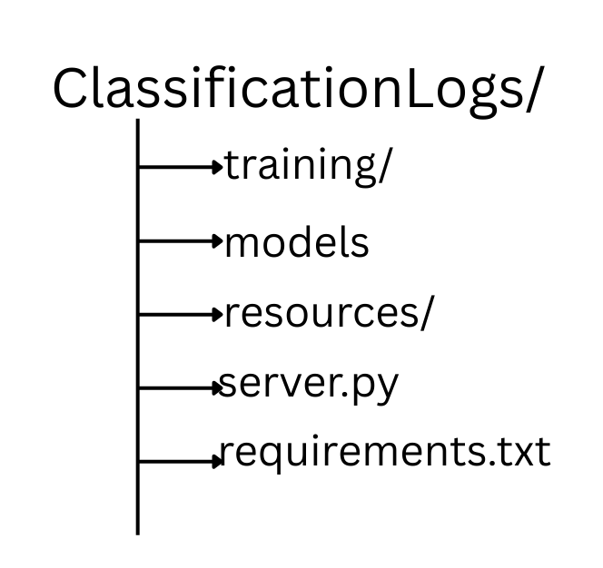

# Log Insights Through Hybrid Classification!
This project introduces a versatile log classification system that combines multiple techniques to effectively process log data ranging from simple, well-structured entries to complex or unlabeled messages. By blending traditional and modern approaches, the framework ensures adaptability and robustness in real-world scenarios.

---

## Classification Techniques Used

1. **Regular Expression (Regex)**:
   - Ideal for handling straightforward, consistent log patterns.
   - Applies rule-based logic to detect and classify known formats.

2. **Sentence Transformer + Logistic Regression**:
   - Designed for more intricate patterns with sufficient training data.
   - Converts log messages into semantic embeddings using Sentence Transformers and classifies them using a Logistic Regression model.

3. **LLM (Large Language Models)**:
   - Best suited for ambiguous or rare patterns where labeled data is limited.
   - Acts as a backup strategy or complementary method to the above models.


---

## Folder Structure



---

## Setup Instructions

1. **Install Dependencies**:
   Ensure Python is installed, then install dependencies via:

   ```bash
   pip install -r requirements.txt
   ```

2. **Run the FastAPI Server**:
   To start the server, use the following command:

   ```bash
   uvicorn server:app --reload
   ```

   Once the server is running, you can access the API at:
   - `http://127.0.0.1:8000/` (Main endpoint)
   - `http://127.0.0.1:8000/docs` (Interactive Swagger documentation)
   - `http://127.0.0.1:8000/redoc` (Alternative API documentation)

---

## Usage
To classify logs:

Upload a CSV file containing logs to the FastAPI endpoint for classification. Ensure the file has the following columns:
- `source`
- `log_message`

The output will be a CSV file with an additional column `target_label`, which represents the classified label for each log entry.

## Features At a Glance

- Hybrid Classification (Regex + ML + LLM)
- FastAPI-powered interactive API
- Supports dynamic CSV uploads
- Flexible and modular architecture
